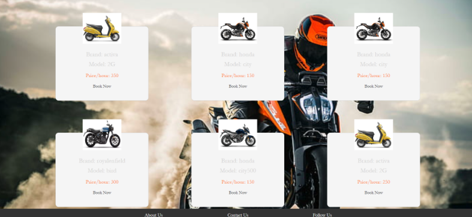

# Bike-Rental-System
1. User Logins to the website:

2. Checks out the bike from bike listing Page:

3. Enters the Journey Start time and journey End Time:

4. User is informed about the total price for the duration:

5. After User confirms the booking mail is sent to the user 

6. User can show the booking status in his/her bookings

7. User Profile Page:

